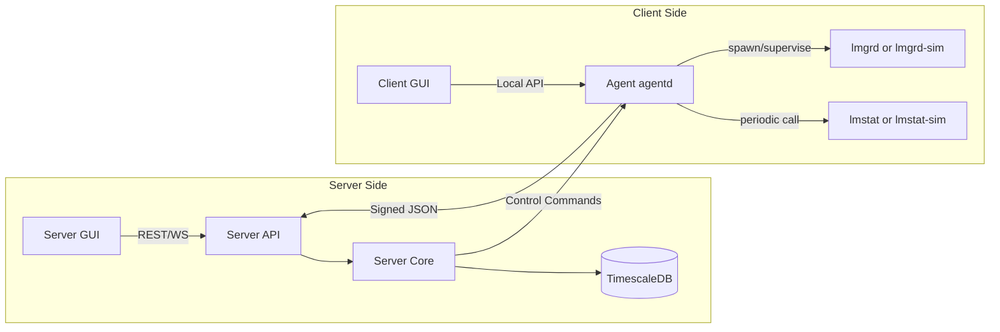
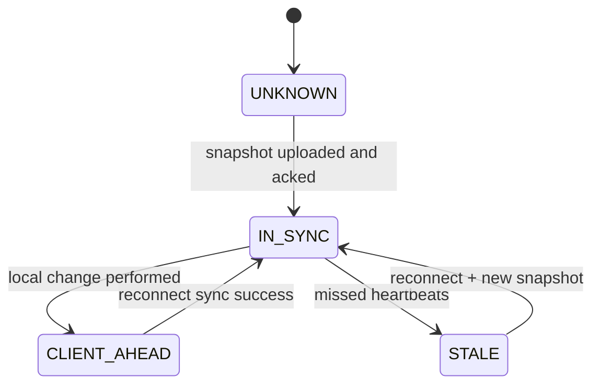
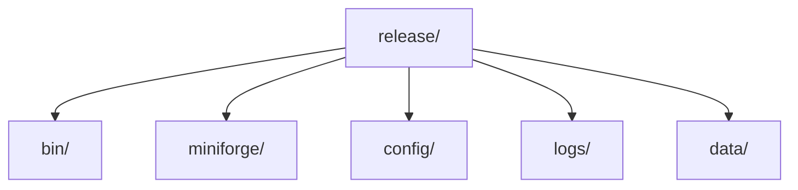

# License Manager Technical Specification (v1.8)

## 1. Background and Intention

### 1.1 Background

Many IT teams manage FlexLM-style licenses using vendor tools (lmgrd, lmstat) and ad-hoc scripts. This creates recurring operational problems:

*   **Fragmented visibility**: license usage and health are scattered across hosts and log files.
*   **Manual, error-prone operations**: start/stop/reread/license updates are executed inconsistently, often via SSH.
*   **Weak auditability**: it is difficult to answer “who changed what, when, and why” after incidents.
*   **Hard-to-scale governance**: as the number of license servers and sites grows, operational consistency degrades.
*   **Offline/local constraints**: license hosts may be in restricted networks; local IT still needs to operate when the central server is unavailable.
*   **Messy data**: lmstat output and license logs are semi-structured, vary by vendor/options, and are not designed for analytics.

### 1.2 Intention

This project builds a server–client license manager to provide a consistent operational layer around vendor licensing, with the following intentions:

*   **Centralized observability**: Provide a fleet-level view of license availability, usage, expiry risk, and service health across all managed license endpoints (port@server).
*   **Safe, consistent operations**: Standardize common actions (start/stop/restart/reread/apply config and license artifacts) behind explicit workflows, with idempotency and clear failure reporting.
*   **Client independence with synchronization**: Each client must remain operable locally (with its own GUI) even when the server is offline, while ensuring changes are durably journaled and later synchronized to the server.
*   **Structured data for analysis**: Ingest lmstat samples and relevant operational telemetry into a structured database (TimescaleDB) to enable time-series analysis, reporting, and long-term capacity planning.
*   **Deterministic testing via simulators**: Provide lmgrd-sim and lmstat-sim to support deterministic development, integration testing, and reproducible incident/debug scenarios.

### 1.3 Scope Boundaries

The system:

*   orchestrates vendor tooling; it does not replace vendor enforcement logic.
*   does not require remote shell access or direct filesystem browsing across hosts.
*   treats the server as the central auditor/aggregator, while client effective configuration remains authoritative on each client (to preserve offline capability).

## 2. System Overview

The system is a distributed license operations control plane for FlexLM-style environments, deployed in **server–client mode**:

* **Server Core (headless)**: orchestration, aggregation, audit, storage, policy, API
* **Server GUI**: administrative control and visibility
* **Client Agent (daemon)**: executes lmgrd/lmstat, manages local config, offline operation, journaling
* **Client GUI**: local operator UI (talks only to Agent)
* **TimescaleDB**: primary storage (external default; embedded optional)
* **Simulators**:

  * `lmgrd-sim`: deterministic license service simulator
  * `lmstat-sim`: deterministic lmstat-like output generator consistent with lmgrd-sim

---

## 3. Architecture

### 3.1 Topology



### 3.2 Authority Model

* **Client-authoritative config**: client effective config is authoritative; server stores snapshots and history.
* **One active server per client**: bound by `(server_id, server_addr)`.
* **GUIs propose intent**; **agent executes**; **server stores audit + aggregation**.

---

## 4. Components

## 4.1 Server Core (Headless)

Responsibilities:

* Accept agent connections (auth + protocol compatibility)
* Store:

  * config snapshots
  * time-series samples
  * structured operational events
  * raw records with retention
  * audit logs
  * edit leases
* Dispatch control requests to agents
* Provide APIs to Server GUI
* Provide parsing services for raw lmstat output into structured samples (versioned parsers)

Constraints:

* No direct access to client filesystem
* No direct process control on clients (only via agent command channel)

---

## 4.2 Server GUI (Admin GUI)

Responsibilities:

* Fleet view: agents, health, last-seen, stale
* License view: features, usage, expiry, per port@server
* Edit workflow:

  * refresh config from agent
  * acquire edit lease
  * submit idempotent change request (applied by agent)
* Global actions: start/stop/restart/reread/apply change_set/diagnostics

Constraints:

* Talks only to Server API (no direct agent connections)
* Never assumes success until agent confirms

---

## 4.3 Client Agent (agentd)

Responsibilities:

* Maintain client-authoritative effective config
* Run and supervise:

  * vendor `lmgrd` or `lmgrd-sim`
  * vendor `lmstat` or `lmstat-sim`
* Capture and ship:

  * raw lmstat outputs
  * operation results
  * optional lmgrd logs / key excerpts
* Provide local API to Client GUI
* Support offline operation:

  * perform local operations while server is down
  * persist durable event journal
  * sync snapshots and events when server reconnects
* Enforce idempotency and base revision checks for server-initiated changes

---

## 4.4 Client GUI (Local GUI)

Responsibilities:

* Talks **only** to the local agent API
* Shows:

  * local effective config (rev/hash)
  * lmgrd status + ports
  * latest lmstat sample (raw + parsed if available)
  * local logs (agent/lmgrd)
  * last-known server snapshot info proxied by agent
* Allows local operations via agent (including offline), with clear indication of server connectivity and staleness

---

## 4.5 Database (TimescaleDB)

Default: external TimescaleDB
Optional: embedded DB (explicitly enabled; single-node; non-HA)

Used for:

* time-series lmstat samples (hypertables)
* structured events and audit logs
* raw records with retention
* config snapshots

---

## 4.6 Simulators

Simulators are mandatory for deterministic testing and development. They are **not** a mock; they are executable substitutes for vendor tooling with stable outputs.

### 4.6.1 lmgrd Simulator (`lmgrd-sim`)

#### Purpose

Provide a deterministic executable that mimics a subset of lmgrd behavior sufficient for:

* agent supervision (start/stop/restart)
* log generation
* consistent backing state for lmstat-sim
* simulating checkout/release and feature counts

#### CLI Compatibility (subset)

Must accept a CLI compatible with the required use cases:

* `lmgrd-sim -c <license.dat> -o <logfile>`
* (optional) accept `-l` alias if needed for compatibility with scripts

Example:

* `lmgrd-sim -c license.dat -o license.log.20260126`

#### Inputs

* `license.dat` containing dummy feature definitions:

  * feature name
  * total count
  * optional expiry date
  * optional vendor string

A minimal supported dummy format must be specified (see below).

#### Behavior

* On startup:

  * parse `license.dat`
  * create in-memory feature inventory
  * open log file and write startup banner
  * listen on configured port (from license.dat or CLI) if simulation includes request channel
* While running:

  * accept simulated “checkout” / “release” requests
  * update usage counts (checked out seats)
  * log changes and periodic heartbeats
* On shutdown:

  * flush state and write shutdown banner

#### License Request Channel (simulation)

Because real FlexLM protocol is proprietary, the simulator uses a **simple text/JSON TCP protocol** (local loopback or configurable port), e.g.:

* `CHECKOUT {"feature":"foo","user":"u1","host":"h1"}`
* `RELEASE {"feature":"foo","user":"u1","host":"h1"}`
* `STATUS`

Response examples:

* `OK {"granted":1,"in_use":3,"total":10}`
* `DENY {"reason":"NO_FREE_SEATS","in_use":10,"total":10}`

This channel is only required to support deterministic tests and sample generation.

#### Minimal `license.dat` dummy grammar (spec-defined)

To avoid dependency on real FLEX syntax, define a small, parseable format, e.g.:

```
PORT 27000
FEATURE alpha 10 EXPIRES 2026-12-31
FEATURE beta  3  EXPIRES 2026-06-30
FEATURE gamma 25
```

Agent tests and lmstat-sim must rely on this grammar.

---

### 4.6.2 lmstat Simulator (`lmstat-sim`)

#### Purpose

Generate `lmstat`-like textual output that:

* is deterministic
* reflects current lmgrd-sim state
* is parseable by your server parser
* supports periodic sampling by agent

#### CLI Compatibility (subset)

Must accept:

* `lmstat-sim -c <port@server> -a -i`
* `lmstat-sim -c <port@server> -f <feature_name> -i`

Where:

* `-i` means “include usage details” (or a stable verbose mode)
* `-a` means “all features”
* `-f` filters a feature

#### Behavior

* Connect to lmgrd-sim request channel (or read its state file/socket)
* Generate text output in a stable, testable format that approximates `lmstat`

Example output requirements (not exact FlexLM, but stable):

* must include:

  * server identity (host, port)
  * timestamp
  * feature list with `total` and `in_use`
  * optionally list active checkouts if `-i`

#### Determinism Requirements

For a given:

* lmgrd-sim state
* same CLI args

Output must be identical except for explicitly marked timestamp fields (which can be fixed in test mode).

---

## 5. Configuration Model (Client-Authoritative)

### 5.1 Client Effective Config

Client agent maintains:

* `config_rev` (monotonic)
* `config_hash`
* `last_applied_time`
* `server_binding` = `(server_id, server_addr)`
* tool paths: lmgrd path, lmstat path
* license assets paths: license.dat, option file, log path
* managed endpoints: list of `port@server` items

Server stores **snapshots** only:

* `reported_rev/hash`
* payload (optional redacted fields)
* `reported_at`

---

## 6. Single Active Server Binding

* Agent accepts commands only from the bound `server_id`.
* Rebinding requires explicit local operator action (or a secured rebind procedure).
* Prevents split-brain control when servers change.

---

## 7. Protocol Compatibility

* Use protocol-version negotiation:

  * server declares `min_supported_protocol`, `max_supported_protocol`
  * agent sends `protocol_version`
* If outside range: reject.

---

## 8. Sync, Revisions, and Editing

### 8.1 Sync States



### 8.2 Server GUI Edit Lease (Concurrency control)

* server issues per-client `lease_id` with TTL
* at most one active lease per client
* required for server-initiated config proposals

### 8.3 Idempotent Change Requests

Every change request includes:

* `change_id`
* `lease_id`
* `base_config_rev`
* `change_set`

Agent applies only if:

* `change_id` not already applied
* `base_config_rev == current_config_rev`

If apply succeeds:

* agent increments `config_rev`
* writes local journal event
* reports new snapshot to server

---

## 9. Offline Local Operations

* Client GUI operates through agent even when server offline
* All local operations are journaled durably (SQLite recommended)
* On reconnect: agent uploads delta journal + latest snapshot

---

## 10. Data Storage (TimescaleDB)

### 10.1 Logical Tables

Hypertables:

* `lmstat_samples`
* `license_usage_samples` (optional derived)

Tables:

* `agents`
* `config_snapshots`
* `raw_records` (retention N days)
* `events_structured`
* `audit_log`
* `edit_leases`
* `control_requests`
* `control_results`

### 10.2 Retention

* raw records retained N days (configurable)
* time-series retained long-term (configurable)
* audit retained long-term

Server runtime logs remain file-rotated (diagnostic only).

---

## 11. Logging

Client:

* rotating runtime logs
* optional lmgrd logs
* durable event journal

Server:

* rotating runtime logs
* authoritative operational data in DB

---

## 12. Control Actions

Supported actions (initiated by either GUI, executed by agent):

* start/stop/restart lmgrd
* reread license
* apply change_set (includes license.dat/options/log path/port config)
* diagnostics

All control requests are idempotent.

---

## 13. Testing Requirements

Mandatory:

* simulator-backed integration tests:

  * start lmgrd-sim
  * run lmstat-sim periodically
  * verify agent shipping raw output
  * verify server parsing and DB storage
* protocol negotiation tests
* idempotency tests
* offline journal persistence tests
* retention policy tests

---

## 14. Packaging & Portability

* No installer
* Unpack-and-run
* Target RHEL7 first; compatible with RHEL8 later
* Miniforge runtime allowed; must be relocatable
* Release layout (recommended):



---

## 15. Security (Baseline)

* agent auth is separate from user auth
* agent bound to `server_id`
* server GUI actions audited
* secrets never transmitted in telemetry

---
