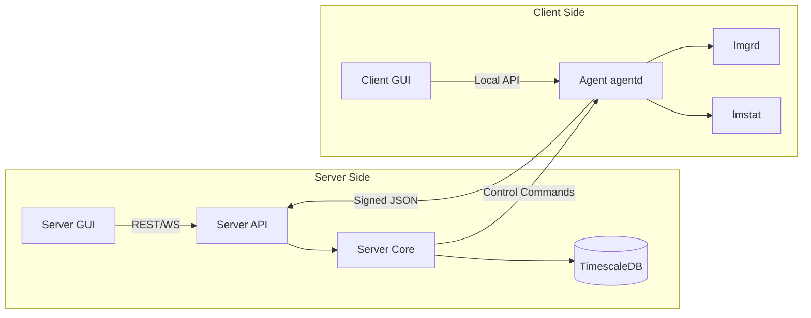
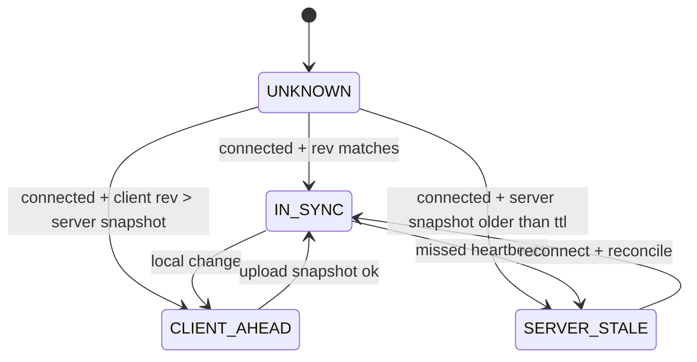
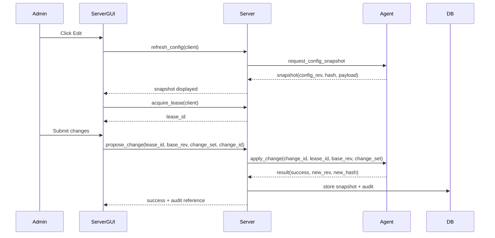
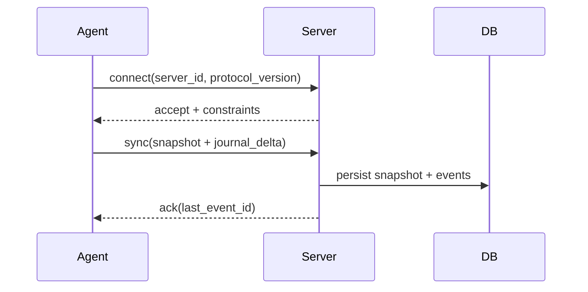
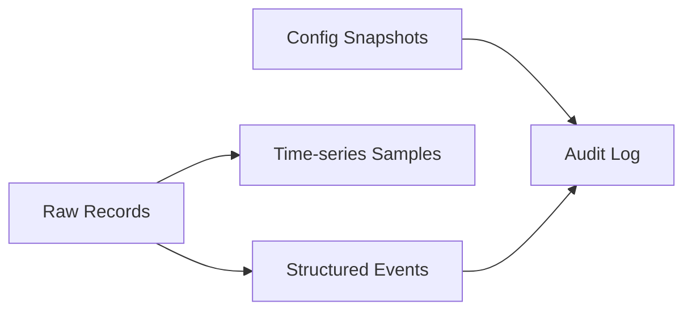
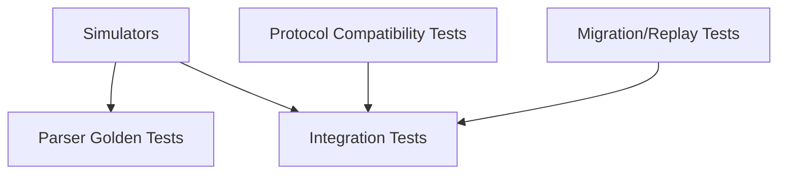
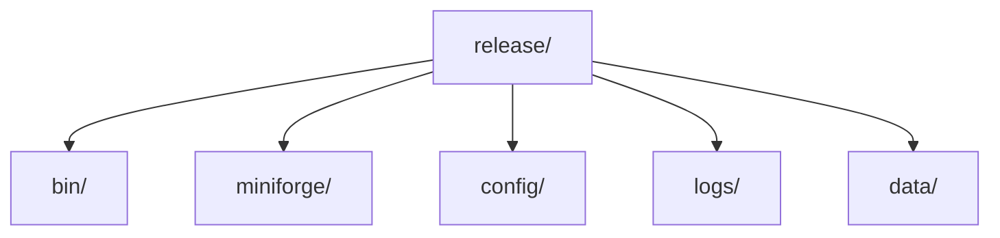

# License Manager Technical Specification (v1.6)

> This document is the **full authoritative spec** incorporating all decisions from our discussion:
>
> * **Server–client mode**
> * **Two GUIs** (Server GUI + Client GUI)
> * **Client-authoritative configuration**
> * **Single active server per client (pinned by `server_id`)**
> * **Offline-capable client ops + durable local journal**
> * **Idempotent control requests**
> * **Config revisioning + edit leases**
> * **TimescaleDB storage + retention**
> * **Portable “unpack-and-run” release on RHEL7, future RHEL8**

---

## 1. System Goals

The system provides:

* Centralized observability and governance for FlexLM-style license services
* Safe operational control (start/stop/reread/upload/diagnostics)
* Time-series analytics (lmstat samples)
* Offline-capable local operations on clients with later server synchronization
* Deterministic, auditable behavior

Non-goals:

* Re-implementing FlexLM enforcement
* Direct server access to client filesystem (no remote shell)
* GUI-only operation (server core must be headless)

---

## 2. Architecture Overview

### 2.1 Topology

### 2.2 Trust & Authority Model

* **Server Core** is authoritative for:

  * global orchestration policy
  * audit trail in DB
  * visibility aggregation across clients
  * server-issued **edit leases**
* **Client Agent** is authoritative for:

  * **effective configuration** on that host (**client-authoritative config**)
  * executing operations and recording local events
* **Server does not own configuration truth**; it stores **snapshots** reported by clients.
* **Client GUI** is not authoritative; it only interacts with the local agent.

---

## 3. Components

### 3.1 Server Core (Headless)

Responsibilities:

* Ingest telemetry + events from agents
* Store and query:

  * time-series lmstat metrics
  * structured operational events
  * raw records (retention)
  * config snapshots reported by agents
  * audit logs
* Dispatch control requests to agents
* Enforce:

  * authentication/authorization
  * edit lease issuance and validation
  * protocol compatibility
* Provide APIs for Server GUI and automation

### 3.2 Server GUI (Admin GUI)

Responsibilities:

* Fleet view: clients, license servers, status, trends
* Show last-known client config snapshots and drift/staleness
* Provide **edit workflow**:

  * refresh from client
  * acquire edit lease
  * submit change request to client
* Initiate global control actions (start/stop/reread/upload/diagnostics) via server core

Constraints:

* Never talks to agents directly
* Never reads DB directly
* Never assumes changes are applied until agent confirms

### 3.3 Client Agent (agentd)

Responsibilities:

* Run and supervise `lmgrd` and `lmstat`
* Expose local API to Client GUI
* Maintain **client-authoritative config** and revision
* Execute operations:

  * start/stop/restart/reread
  * license upload/apply (local file updates)
  * diagnostics collection
* Capture:

  * `lmstat` stdout
  * relevant `lmgrd` logs
  * operation results
* Persist:

  * local rotating runtime logs
  * **durable local event journal** for offline mode
* Sync:

  * config snapshots + event journal to server when connected

### 3.4 Client GUI (Local GUI)

Responsibilities:

* Display local state from agent:

  * running status, ports, effective config, local logs view
  * last-known server snapshot (proxied by agent), including timestamps
* Allow local operations via agent:

  * subject to policy and sync status rules defined below
* Show conflict/difference prompts when server view is stale or when server-issued changes are pending

Constraints:

* Talks only to local agent
* No direct server connection
* No direct DB connection

### 3.5 Database: TimescaleDB (PostgreSQL)

Primary mode: external TimescaleDB
Optional mode: embedded DB (explicitly enabled; single-node; non-HA)

---

## 4. Configuration Model (Client-Authoritative)

### 4.1 Configuration Ownership

**Effective config lives on the client agent** and is the only authoritative source of configuration.

Server stores:

* snapshots of client config (last-known)
* desired proposals (optional queue), but not authoritative until applied by client

### 4.2 Config Revisions

Each client agent maintains:

* `config_rev` (monotonic integer)
* `config_hash` (hash of normalized config)
* `last_applied_time`
* `server_binding`:

  * `server_id` (UUID)
  * `server_addr` (host:port)

Server stores last-known for each agent:

* `reported_config_rev`
* `reported_config_hash`
* `reported_at`

### 4.3 Local Config Files

#### 4.3.1 Server local config file (bootstrap only)

Stored locally, schema-validated:

* API listen address/port
* DB connection parameters (or embedded DB path)
* server log path + rotation settings
* retention policy defaults
* security material paths (certs/keys)

#### 4.3.2 Client local config file (bootstrap + identity)

Stored locally, schema-validated:

* `server_id` + `server_addr` binding
* agent identity (agent_id, hostname)
* local runtime paths:

  * lmgrd path
  * lmstat path
  * log path
  * license.dat path
  * options file path
  * port@server mapping(s)

**Note:** the above are still *client-authoritative*. The server stores snapshots for visibility.

---

## 5. Single Active Server Binding

### 5.1 Binding Rules

* Each agent is bound to exactly one active server identified by `(server_id, server_addr)`.
* Agent will:

  * accept commands only from the bound `server_id`
  * reject commands from unknown server IDs
* Rebinding requires explicit local operator action on the client (Client GUI) or a secured “rebind procedure”.

### 5.2 Why This Exists

Prevents split-brain control if:

* server address changes
* old server instance returns online
* multiple servers accidentally exist

---

## 6. Protocol Version Compatibility

### 6.1 Protocol Negotiation

All messages include:

* `protocol_version` (integer or semver-like)
* `agent_software_version`
* `server_software_version`

Server enforces a compatibility window:

* `min_supported_protocol <= protocol_version <= max_supported_protocol`

If out of window:

* connection rejected with explicit error
* no partial operation

**No requirement for exact binary version match** (supports rolling upgrades).

---

## 7. Sync State Model

The system uses **revisioned snapshots** and local event journaling rather than “no-conflict assumptions”.

### 7.1 Sync States (Agent Computed, Server Confirmed)

**Interpretation**

* `IN_SYNC`: server snapshot equals client effective config
* `CLIENT_AHEAD`: client has changes not yet synced to server
* `SERVER_STALE`: server view is old (no recent report)
* `UNKNOWN`: startup, first connect, or insufficient data

> Note: With client-authoritative config, “server ahead” is typically not used; server can propose changes but they only become real after client applies.

---

## 8. Edit & Apply Workflow (Server GUI → Client)

You required: *server edits must refresh from client and apply through client (client stays authoritative).*

### 8.1 Edit Lease (Concurrency Control)

Server issues per-client leases:

* `lease_id` (UUID)
* `client_id`
* `issued_at`
* `expires_at` (TTL, e.g., 60s)
* `issued_to_user` (optional metadata)

Rules:

* At most one active lease per client
* Lease required for server-initiated config changes
* Lease expiration invalidates in-flight edits

### 8.2 Refresh-Then-Edit

When admin clicks “Edit”:

1. Server GUI requests **refresh**:

   * server asks agent for current config snapshot
2. Server stores snapshot in DB (if newer)
3. Server GUI requests **edit lease**
4. Server GUI displays config at `(config_rev, config_hash, reported_at)`

### 8.3 Apply Change Request (Idempotent)

A server-initiated change is a **proposal** that becomes authoritative only after the client applies it.

Change request includes:

* `change_id` (UUID)
* `lease_id`
* `base_config_rev`
* `change_set` (atomic set of modifications)
* `server_id`
* `protocol_version`

Agent applies only if:

* `server_id` matches binding
* `lease_id` valid and unexpired (server validated; agent may optionally re-check TTL)
* `base_config_rev == current config_rev` (prevents stale edits)
* `change_id` not already applied (idempotency)

If applied:

* agent updates local files atomically
* agent increments `config_rev`
* agent records event in local journal
* agent reports new snapshot to server

### 8.4 Sequence

---

## 9. Offline Local Operations (Client GUI → Agent)

### 9.1 Local Operations Policy

The client must be operable independently. When server is offline:

* client GUI may still perform local actions via agent
* all such actions must be recorded in local durable journal
* server reconciliation occurs automatically when reconnected

### 9.2 Allowed Actions When Server Offline

Default safe policy (can be configured later):

* ✅ start/stop/restart lmgrd (local)
* ✅ reread (local)
* ✅ diagnostics collection
* ✅ local edits of license.dat/options **if performed as a change_set** and journaled

> Because you explicitly want independence, risky actions are allowed offline — but must be journaled and later uploaded.

### 9.3 Local Change Sets & Journaling

Agent must store an append-only durable journal (recommended SQLite):

* `event_id`
* `event_time`
* `change_id` (optional)
* `action_type`
* `config_rev_before/after`
* checksums of changed artifacts (license.dat/options)
* apply result + reason
* `pending_upload` flag

Rotating text logs are **not** sufficient as an audit source.

---

## 10. Reconnect & Automatic Sync (Client → Server)

Your rule: *when server becomes available again, client changes automatically sync to server; server view is derived from client.*

### 10.1 Reconnect Sync Steps

On reconnect:

1. Agent authenticates to server and validates `server_id` and protocol window
2. Agent sends:

   * current config snapshot (`config_rev`, `hash`, payload)
   * local journal events since last acknowledged upload (bounded)
3. Server:

   * stores snapshot
   * stores uploaded events (raw + structured)
   * marks agent as “current” at time T
4. Server responds with ack and last stored journal offset

### 10.2 Sequence

---

## 11. Conflict Handling (Reduced, But Still Defined)

Even in a client-authoritative model, “conflicts” can occur as **stale edits or failed applies**.

This spec defines “conflict” narrowly:

* **Stale edit**: server proposes change with `base_config_rev` not equal to current client rev → agent rejects
* **Apply failure**: agent cannot apply change_set (permission/disk/validation) → recorded and visible

Resolution:

* Server GUI must show:

  * rejection reason
  * current client rev/hash
* Operator retries after refresh + new lease

> There is no “merge”; server does not override client authority. The operator fixes and re-applies.

---

## 12. Data Storage Specification (TimescaleDB)

### 12.1 Data Classes

### 12.2 Tables / Hypertables (Logical)

* Hypertables:

  * `lmstat_samples` (time-series)
  * `license_usage_samples` (time-series; derived)
* Regular tables:

  * `agents`
  * `config_snapshots`
  * `control_requests`
  * `control_results`
  * `events_structured`
  * `raw_records`
  * `audit_log`
  * `edit_leases`

### 12.3 Retention

* `raw_records`: retained N days (configurable)
* time-series: long-term (configurable)
* audit: long-term

Server runtime logs:

* **file-based rotating logs** (not in DB)

---

## 13. Logging Specification

### 13.1 Client

* `agentd` runtime logs:

  * rotating file logs (path + max size + rotation count)
* `lmgrd` logs:

  * captured as files, optionally tailed/forwarded as raw records (with retention)
* operational journal:

  * durable and non-rotating (bounded by retention/compaction policy)

### 13.2 Server

* server runtime logs:

  * rotating file logs (path + max size + rotation count)
* authoritative operational records:

  * in TimescaleDB (events + audits)

---

## 14. Control Actions

Supported operations (initiated by either GUI, executed by agent):

* start lmgrd
* stop lmgrd
* restart lmgrd
* reread license
* apply change_set (config/files)
* diagnostics

### 14.1 Idempotency

All control requests use:

* `request_id` / `change_id` (UUID)

Agent must:

* store applied IDs (at least N days or bounded LRU)
* return same result on duplicate

---

## 15. Testing Requirements

### 15.1 Test Types (Mandatory)

Minimum requirements:

* Parsers: golden fixtures (lmstat output → structured output)
* Protocol: negotiation tests across supported versions
* Idempotency: duplicate request tests
* Leases: concurrent edit rejection tests
* Offline mode:

  * local change journal persistence across restart
  * reconnect upload correctness
* TimescaleDB retention: raw record expiration does not break aggregates

---

## 16. Simulator Suite

### 16.1 lmgrd Simulator

* deterministic state model
* produces predictable logs/output
* supports feature capacities, checkout/release, expiries

### 16.2 lmstat Simulator

* generates `lmstat`-like text output
* consistent with simulated lmgrd state
* used for parser and integration fixtures

---

## 17. Packaging & Portability (RHEL7 first)

### 17.1 Release Requirements

* No installer
* Unpack into any folder and run
* Must run on RHEL7; target compatibility with RHEL8

### 17.2 Recommended Layout

Rules:

* no hard-coded absolute paths
* runtime uses paths relative to release root
* any embedded DB lives under `data/` and is explicitly enabled

---

## 18. Security (Baseline)

* Agent authenticates to server using credentials bound to `server_id` + `agent_id`
* Server GUI authenticates as user (separate from agents)
* All control actions produce an audit log record
* Secrets:

  * never sent in telemetry
  * never logged in plaintext

(Full RBAC can be specified later; the spec requires separation of agent identity vs user identity.)

---

## 19. Summary of Key Invariants

1. **Client-authoritative config**: server stores snapshots, not truth.
2. **Single active server per client** via `server_id` binding.
3. **Server GUI edits must refresh + lease + base_rev**.
4. **All requests are idempotent**.
5. **Offline operations are durable** (journal) and sync automatically on reconnect.
6. **Client GUI talks only to agent** (agent proxies server snapshot).
7. **TimescaleDB is primary storage**, with retention for raw records.
8. **Portable unpack-and-run deployment** on RHEL7 baseline.
